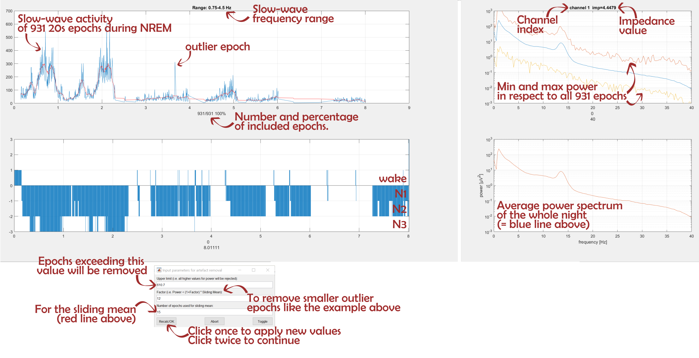

# Artifact rejection
> By Sven Leach

## Definition
These noise, or artifact, sources include: line noise from the power grid, eye blinks, eye movements, heart beat, breathing, and other muscle activity. Some artifacts, such as eye blinks, produce voltage changes of much higher amplitude than the endogenous brain activity. 

## Types of artifacts
https://www.researchgate.net/profile/Alok_Mittal/publication/228951651_ARTIFACT_REMOVAL_FROM_EEG_RECORDINGS-AN_OVERVIEW/links/00b7d52676ccdc1fa7000000/ARTIFACT-REMOVAL-FROM-EEG-RECORDINGS-AN-OVERVIEW.pdf

https://www.caeaccess.org/research/volume4/number1/tandle-2016-cae-651997.pdf

If the source is the subject’s body, that artefact is
called physiological artefact. If the source is external it is
called external artefact.

### Physiological artifacts
Physiological Artefacts
Physiological artefacts are the artefact originated because of
electrical activity of other body parts of the subject and
obscure the EEG signals

#### Eye blinks
Eye Blink artifact: It is very common in EEG data,
produces a high amplitude signal that can be many
times greater than EEG signals of interest. Because
of its high amplitude an eye blink can corrupt data on
all electrodes, even those at the back of the head. Eye
artifacts are often measured more directly in the
electrooculargram (EOG), pairs of electrodes placed
above and around the eyes. Unfortunately, these
measurements are contaminated with EEG signals of
interest and so simple subtraction is not a removal
option

Eye blinks produce high amplitude signals that can be many
times greater than the amplitude of EEG signals of interest.
Repetitive blinks produce slow wave, which appear like delta
waves 

#### Eye movements
These artifacts are caused by the
reorientation of the retinocorneal dipole [3]. The
effect of this artifact is stronger than that of the eye
blink artifact. Eye blinks and movements often occur
at close intervals. 

A movement of the eyes and eyeballs causes a change of
potential in the electrodes near the eyes at Fp1-Fp2 (Fronto
Parietal). Fluttering of the eyelids appears as a 3Hz –10Hz
signal.

ERG or Elertroretinogram is a potential difference between
retina and cornea of the eye and with incident light; it
changes, causing artefacts in EEG signals. Voltage amplitude
is proportional to the angle of gaze. This artefact mixed with
slow EEG is prominent in REM sleep 

#### Muscle Activity
These artifacts are caused by
activity in different muscle groups including neck
and facial muscles. These signals have a wide
frequency range and can be distributed across
different sets of electrodes depending on the location
of the source muscles.

#### Heart beat
When an electrode is placed on or near a
blood vessel, it causes pulse, or heart beat, artifact.
The expansion and contraction of the vessel
introduce voltage changes into the recordings. The
artifact signal has a frequency around 1.2Hz, but can
vary with the state of the object. This artifact can
appear as a sharp spike or smooth wave [4]. 

#### Breathing

#### Sweat
Perspiration artefact exhibited as low amplitude, swelling
waves that typically have durations greater than 2 sec; thus,
they are beyond the frequency range of cerebrally generated
EEG

#### Movement

### External Artefacts
The sources of these artefacts are electronic gadgets,
transmission lines etc.

#### Line noise
Strong signals from A/C power
supplies can corrupt EEG data during transfer from
the scalp electrodes to the recording device. Notch
filters are often used to filter this artifact containing
lower frequency line noise and harmonics. Notch
filtering at these frequencies can remove useful
information. Line noise can corrupt the data from
some or all of the electrodes depending on the source
of the problem.

#### Electrode pops

#### Phone Artefact
This artefact is because of mobile phone signal. A high
frequency signal appears as a spurious signal on the EEG
signals. Remedy for this artefact is not to carry a mobile
phone while recording this artefact shown in fig10.electrical
characteristic shown in table 1.

#### Poor electrode contact
Poor electrode contact gives rise to low frequency artifacts,
they are brief transients that are limited to one-electrode and
synchronize with respiration due to the motion of the
electrode. 

## Artifact removal

### Our lab's approach
As sleep EEG consists hours and hours of data, cleaning sleep EEGs can usually be accomplished by simply removing the parts of the data which contain artifacts. In our lab, this is done in two steps:

1.  During sleep scoring, 4s epochs are visually classified as clean or noisy. As we perform sleep scoring in 20s epochs, any 4s epoch within a 20s epoch will result in the particular 20s epoch to be classified as noisy as well. During sleep scoring, we see the data of one frontal, one central and one occipital channel. Even though manual artifact removal can be considered as one of the most thorough procedures, going through all 128 HD-EEG channels manually would require a tremendous amount of work.

Show tick boxes of sleep scoring programm

2.  This is why in a second step, we perform a semi-automatic artifact removal procedure on all 128 HD-EEG channels. For this, the power in the slow-wave (0.75 – 4.5 Hz) and muscle (20 – 40 Hz) frequency band is computed for all remaining 20s epochs and all channels. Remaining 20s epochs are those that were not marked as noisy during sleep scoring. The power is computed with an FFT routine (Hanning window, averages of five 4 s epochs). The power values of all epochs are visualized for each channel consecutively. Whenever the power in either the slow-wave or muscle frequency band peaks out from their neighbours, it is likely that this epoch contains an artifact and is removed.

3.  Eventually you will build a matrix (channel x epochs) of zeros and ones. Clean epochs are labelled as ones, whereas noisy epochs are reffered to with zeros. We usually perform our analyses only on those parts of the data, in which *all* channels are clean, meaning in which all channels have the number one.

Show final matrix ...
Show visualization of artndx.mat ...

### Other approaches

#### Filter
Using a band pass filter with a frequency band of artefact,
particular artefact can be removed. This method is not a very
useful method for analysis of the entire bandwidth of EEG, as
artifacts can occur at any frequency. A 50 Hz notch filter can
used for removal of transmission line frequency. Low pass
filter can used for Oculogram artefact removal. 

#### EOG subtraction

#### ICA

#### PCA

#### Joint approximate diagonalisation of Eigen matrices (JADE)