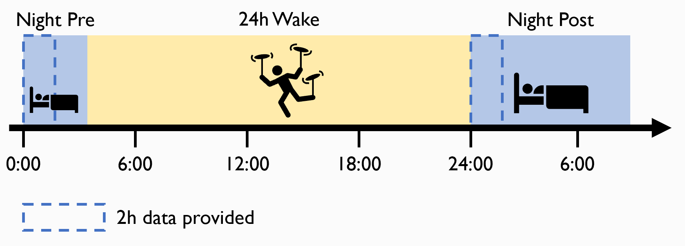

# Example data for this tutorial
> By Sophia Snipes

The data used for this tutorial comes from Snipes et al. (2021, in progress). This is a sleep deprivation study, in which the first 2 hours of the night before and the night after 24h sleep deprivation period are provided.

<p>&nbsp;</p>

## Experiment Design

### Participants
19 healthy young subjects (ages 18-26, 10 female) were recruited from Switzerland. They had been screened through an online questionnaire for any sleep disturbances, health issues, and substance use.  

A subset of 5 were selected for this tutorial, based on having experienced the most severe effects of sleep deprivation.

> N.B. Selecting already significant subjects is blatent "double dipping" and is only acceptable in the context of this tutorial to ensure statistically significant effects with such a small sample. Don't do this with real data.

<p>&nbsp;</p>

### Methods



Participants were fitted with a high-density EGI Geodesic net (128 channels), with a CZ reference. Impedences were kept below 25 kOhm. Data was collected at 100Hz sampling rate. 
Participants went to bed at their usual bed time (after 16h of wake), and were woken up after 4 hours. They were kept awake for 24h performing tasks and watching TV (no spinning disks involved, but it was close). They then went to bed again, and were allowed to sleep in as long as needed.


### Hypothesis
Early studies found that **slow wave activity** (SWA, 1-4Hz delta power) during deep sleep was linked to time spent awake. At the beginning of the night SWA is highest, and exponentially decreases over the course of sleep. This finding led to the 2-process model of sleep:


Basically, a circadian component regulates sleep drive based on time of day, and a **homeostatic** component increases sleep drive with increasing time awake. SWA is a marker for sleep pressure of the homeostatic component. Therefore:

<u>Slow wave activity should be higher at the beginning of the night after 24h of wake.</u>


<p>&nbsp;</p>
------
<p>&nbsp;</p>

## Step 0: Converting data
Different recording devices save data in different, usually proprietary, formats. 
For simplicity, this tutorial provides the data already in a MATLAB-friendly format, but below are brief instructions on how to convert data from the two most common recording devices used by our lab.

### Organization of data provided for the tutorial
For every participant, 2 **.mat** files are provided, *night pre* and *night post* relative to the 24h wake period. Each is only the first 2 hours of the night, so that the files aren't too heavy. Data can be loaded into MATLAB with the following code:

```
Filename = 'P1_nightpre.mat';
Filepath = fullfile('C:\Users\me', 'testdata', 'raw');

load(fullfile(Filepath, Filename), 'data', 'srate', 'chanlocs')

```

- `data` an n by m matrix, with each row n representing a different channel of EEG data, and m a datapoint in time
- `srate` a variable with the sampling rate the data was saved in (1000Hz)
- `chanlocs` a struct containing the coordinates for all the channels, their labels, and any other relevant information


<p>&nbsp;</p>

### BrainAmp
[Here]() is an example script of how to convert data from BrainAmp's **.eeg** format into [EEGLAB's]() **.set** format. While most of this tutorial does not use any toolboxes, most researchers use the EEGLAB or fieldtrip toolbox at least some of the time for EEG data.
[This]() script is the one used to convert the set files into the mat files provided for this tutorial. 


<p>&nbsp;</p>

### EGI