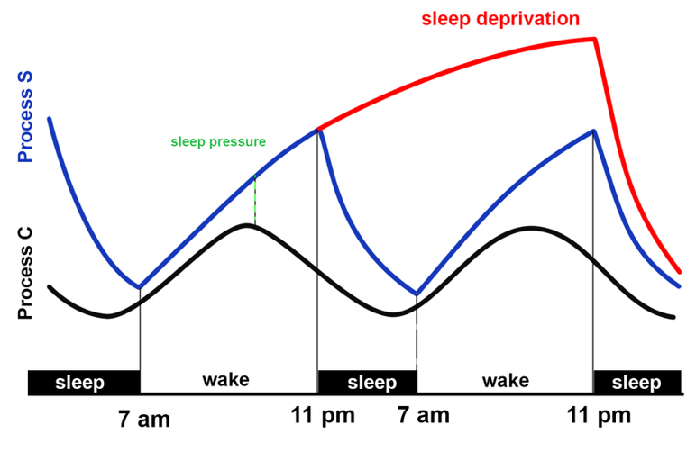

# Big Title
By YourName

## Example Intro
We just love the **2-process model** by *Alexander Borberly*:


I'm not going to bother explaining it, so just look [here](https://en.wikipedia.org/wiki/Sleep).

But! What if someone here already presents it? Well I can just link it like [so](https://hubersleeplab.github.io/README2.html).

### Subpoint to the intro
- Bulleted
- List

1. Numbered
2. List

#### Example Code
```markdown

Var1 = 3;
Var2 = 5;

Result = Var1*Var2;

```

Now just replace the numbers in `Var1` and you can do math!


