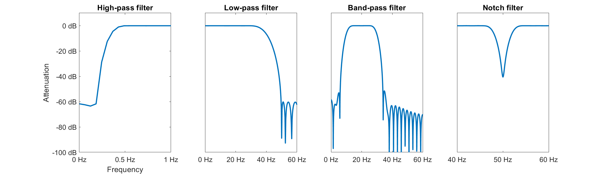
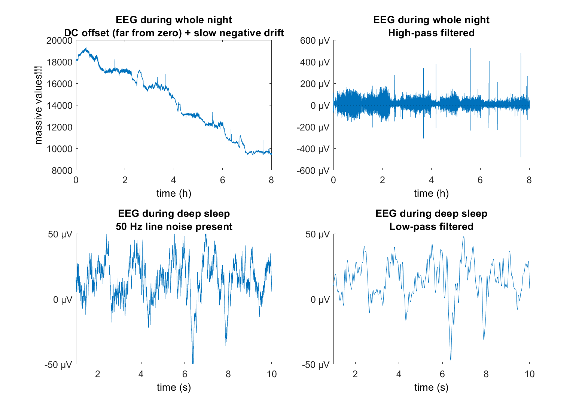

# Filtering and Downsampling
> By Sven Leach (*last updated: not yet*)

## Filtering: Background
One of the major challenges of brain science is that measurements are contaminated by *noise* and *artifacts*. These may include environmental noise (e.g. electrical line noise), instrumental noise, or physiological noise (e.g. signal sources within the body that are not of interest, such as heart beat). **Filters** are commonly used to reduce noise and improve data quality. This is possible in case the noise occupies a spectral region other than your signal of interest. Then the filter can attenuate the noise in the data and leaves the signal of interest (i.e. brain signal) "untouched". In reality, the signal of interest is not really untouched but also affected by the filter, but less so).

## Filter applications
For example, a direct current (DC) component or slow fluctuation may be removed with a **high-pass filter** (a high-pass filter leaves high frequencies in the signal, they "pass" the filter), unwanted high-frequency components may be removed by smoothing the data with a **low-pass filter** (low frequencies are left in the signal, they "pass" the filter), and power line components may be attenuated by a **notch filter** at 50 or 60 Hz (only a specified frequency range is filtered out). A filter that removes low and high frequencies at the same time is called a **band-pass filter** (a specified frequency band, such as 10-20 Hz "passes" the filter).

### Examples of high-pass, low-pass, band-pass & notch filter.
Below you can see the four different filter types and how much these specific examples attenuate certain frequency ranges. The attenuation can be visualized in on a logarithmic scale, usually [decibels (dB)](https://en.wikipedia.org/wiki/Decibel), or on a linear scale, usually percent (%). Zero attenuation means that those frequencies are not touched. Positive attenuation means that frequencies become stronger. Negative attenuation refers to a reduction in amplitude of those frequencies. Those plots show the attenuatoin on a logarithmic scale. As such, an attenuation of -40 dB is not double as strong as -20 dB (as it would be the case on a linear scale), but actually [100x stronger](https://en.wikipedia.org/wiki/Decibel).


### Examples of filtered EEG.
Here are two examples of how filters can reduce unwanted features of the EEG. On top you can see a direct current (DC) component that shifts the signal away from zero by a constant. Correct EEG signal should oscillate around zero. Due to the DC component, we see values of up to 20.000 \muV. Additionally, over 8h of recording, the data contains a slow negative drift which results in a difference of around 10.000 \muV when comparing the beginning to the end of the night. Both unwanted features can be removed by a high-pass filter.

Next you see a very common artifact in EEG data: [50 Hz (EU) or 60 Hz (USA) line noise](https://mindmedia.freshdesk.com/support/solutions/articles/36000205924-how-to-get-rid-of-line-noise-50-or-60hz-interference-in-an-eeg-signal). Electrical devices and cables transport electrical power which is alternating 50 or 60 times per second (alternating current). This 50 or 60 Hertz activity can show up in the EEG, especially where the electrode does not make good contact, or where there are simply too many cables and electrical devices around. It is commonly reduced by using a 50 Hz notch or an appropriate low-pass filter.


## What Is a Filter?
For many of us, a filter is "a thing that modifies the spectral content of a signal." Mathematically, a filter is an operation that produces each sample of the output waveform y as a weighted sum of several samples of the input waveform x. This operation is called convolution and wonderfully explained in this youtube video https://www.youtube.com/watch?v=9Hk-RAIzOaw.

The exact way of how a filter "changes" the data is defined by it's **impulse response function** (that is, the output in response to an impulse). Some filters may smooth the input waveform, others
may enhance fast oscillations. There are numerous different filter types (such as ...) and different ways to implement those filters into software (such as ...). Respectively, there is considerable body of theory, methods, and lore on how best to design and implement a filter for the needs of an application.


## Some terminology
An important goal of neuroscience is to determine causal relations, for example, between a stimulus
and brain activity, or between one brain event and another. If a filter is *causal*, the filter output depends only on past and present samples of the input. If a filter is *acausal*, the filter output also depends on future samples of the input. 

Important in our line of research is at what phase of a slow wave a tone was presented. Some filters introduce a phase shift which is different for each frequency in the signal. In that case, when we analyze the data with a phase shift, we would conclude that tones were presented at a wrong phase of the wave. This is why zero-phase filters are especially important to us. They change the phase of the signal linearly (or evenly) for all frequencies, so that it can be easily corrected. In Matlab.. firfilt .. filtilt..

FIR IIR filters...

## Example on how to build a filter
Within MATLAB alone there are numerous ways on how to build and run a filter. The easiest way is probably to use functions provided by external toolboxes, such as `eegfilt()` or `pop_eegfiltnew()` from the EEGLAB toolbox or `ft_preproc_lowpassfilter()` from the FIELDTRIP toolbox. You typically just give those functions the cut-off frequencies of your choice and they will design and apply the filter for you. When using functions from toolboxes, you can rely on the filterdesign of the people who designed those toolboxes. While this is great for the start, it is usually a blind approach as you do not need to investigate the impulse response function of the filter, meaning that you do not know how well it performance in the frequency vs. time domain.

A more sophisticated and effortful approach, which also requires some knowledge about how filters work, is to design your own filter. MATLAB provides great functionality to design and test a filter rather easily. When executing the command `filterDesigner`, MATLAB's filter Designer opens up which is a visual GUI to design your own filter with various types of specifications. An example of such a filter that I build with MATLAB's filter Designer is this 0.5 Hz high-pass filter.

```m
srateFilt    = 500;   % sampling rate (Hz)
PassFrq      = 0.5;   % pass-band frequency (Hz)
StopFrq      = 0.20;  % stop-band frequency (Hz)
PassRipple   = 0.02;  % pass-band ripple
StopAtten    = 60;    % stop-band attenuation (dB)
HiPassFilt   = designfilt('highpassfir','PassbandFrequency',PassFrq,'StopbandFrequency',StopFrq,'StopbandAttenuation',StopAtten,'PassbandRipple',PassRipple,'SampleRate',srateFilt,'DesignMethod','equiripple');
```

Once the filter is built, you can investigate the filter by visualizing it's impulse reponse using `impz(HiPassFilt, filtord(HiPassFilt))`. This will tell you how the filter will affect an impulse (all zeros expect for the first sample point, which is 1). From the impulse response you can for example see how much your filter "rings" in the time domain, meaning how much the first datapoint is smeared out into the past and/or future in the form of oscillations that become smaller after time.

## What can go wrong?
Unortunately, the use of filters raises many concerns, some serious, others merely inconvenient. Therefore it is important to understand them, and to report enough details that the reader or listener too fully understands them. 

An obvious concern is loss of useful information suppressed together with the noise (a filter does not distinguish between brain signal and noise, it only distinguishes between frequencies). Slightly less obvious is the distortion of the temporal features of the target: peaks or transitions may be smoothed, steps may turn into pulses, and artifactual features may appear, such as response peaks, or oscillations ("ringing") created de novo by the filter in response to some feature of the target or noise signal. The morphology of these artifacts depends on both the filter
and the brain activity. Most insidious, however, is the blurring of temporal or causal relations between features within the signal, or between the signal and external events such as stimuli.

## How to report
As filters can distort the signal, it is extremely important to thourougly report the filters you have used so that the reader can form an opinion about possible effects of filtering. In short, you are save when you report

1.  The filter type
2.  The filter order
3.  Frequency parameters
4.  Whether it was applied in one or both directions (filtfilt)
5.  Advanced: include a plot of the impulse (or step) response function

## Alternatives
Depending on the usecase of your filter, there may be better alternatives. For the example, if the high-pass filter is required merely to remove a constant DC offset, consider subtracting the overall mean instead. If there is also a slow trend, consider "(robust) detrending" rather than high-pass filtering. Detrending involves fitting a function (slowly varying so as to fit the trend but not faster patterns) to the data and then subtracting the fit. Suitable functions include low-order polynomials. Like filtering, detrending is sensitive to temporally localized events such as glitches; however, these can be addressed by "robust detrending" (de Cheveigne et al, 2016, de Cheveigne´ and Arzounian, 2018)

## Downsampling
Downsampling reduces the sampling rate of your data to improve processing speed and to save disc space. We usually record EEGs with a sampling rate of 500 Hz, meaning that we record 500 sampling points per second.

In case one is only interested in oscillations around, let's say, 0.5 to 40 Hz, this is an information overload. Defined by the Nyquest theorem (LINK), a 40 Hz oscillation can be represented in the data with a sampling frequency of 80 Hz (better 120 Hz). You could therefore downsample the recording to produce an approximation of the sequence that would have been obtained by sampling the signal at 125 Hz. It is generally better to choose a sampling rate which is a multiple of the original samplring rate (4 * 125 = 500), as no "new" datapoints need to be estimated. Downsampling at, let's say, 128 Hz would require interpolating non-existing data points.

Lastly, it is important to say that you should always low-pass filter before downsampling (aliasing problem (LINK)).


### Example Intro
We just love the **2-process model** by *Alexander Borberly*:


I'm not going to bother explaining it, so just look [here](https://en.wikipedia.org/wiki/Sleep).

If you can't do something fancy in Markdown, you can just write in HTML: <a href="http://google.com/" target="_blank">Just Google It!</a>

But! What if someone here already presents it? Well I can just link it like [so](https://hubersleeplab.github.io/README2.html).
In case you didn't notice, there's a cute little menu on the left, but it will only write up to three `###` pound signs.

#### Subpoint to the intro
- Bulleted
- List

1. Numbered
2. List

#### Example Code
```m
Var1 = 3;
Var2 = 5;

Result = Var1*Var2;
```


Now just replace the numbers in `Var1` and you can do math!

### Example data

If you're really fancy, you can add a table:

Row Names | Data
----------|----- 
First row | Lots of data
Second row | More data

```m

A = 3;
B = [1 2 3];
F = plot(B,A);

close all
```

The m makes it matlab colored