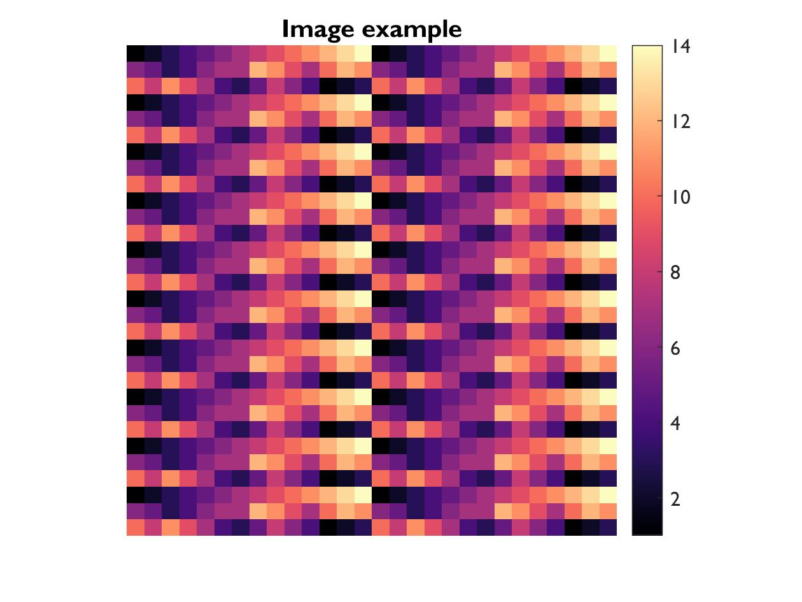

# MATLAB
> By Sophia Snipes (*Last updated: October 2020*)

[MATLAB](https://mathworks.com/products/matlab.html) is the programming language used in this tutorial. You really should know it before getting to this point, but in case it helps, here are a few introductory concepts. The pipeline we use could theoretically be applied to any other programming language, but MATLAB is particularly appropriate because of the heavy use of matrices.


<p>&nbsp;</p>
------
<p>&nbsp;</p>

## 1) Download MATLAB
Depending on your institution, there's different ways to download it. So ask someone or google it.
Once you have it, this is the interface:


<p>&nbsp;</p>

### Key Concepts
- **Console**: This is that box in the bottom with `>>`, where you can "talk" directly to MATLAB, and it answers. This is good as a quick calculator, or a fast way to run functions, and in general is used a lot when writing new scripts.
- **Scripts**: Scripts are "example.m" files that you write in the editor (see picture), and run by pressing that green triangle in the "Editor" tab of the menu bar on top. You can also run them by typing the name of the file in the console.
- **Current location**: matlab will only consider running scripts in the folder in which you are currently located, or in specifically designated paths. You can see which files these are in the "Current Folder" panel on the left.
- **Workspace**: Here (rightmost panel) you can see all the variables you've created and MATLAB is currently holding in memory.


<p>&nbsp;</p>
------
<p>&nbsp;</p>

## 2) Syntax
Here concepts are progressively built on, but if you see in the example code the use of a symbol you're not familiar with, the last section of 2) is a summary of all the special symbols and their meaning.


<p>&nbsp;</p>

### Basic math operations
You can use MATLAB as a caluclator by just writing `3+5` in the console. It will then spit out the result. Unlike a calculator though, you can have variables:

```m
x = 3
a = 2
b = 5

y = x^2 + a*x + b
```

If you write this in a script, it's then easy to change just one variable (x) and re-run all the lines every time (this is why we use scripts). 

Simple math operations include:
- `+` sum
- `-` subtraction
- `*` multiplication
- `^` raise to the power (e.g. `10^2`)
- `/` divide
- `(a+b)` only round parentheses to indicate which math operations to do first


<p>&nbsp;</p>

### Variables
Variables are placeholders (think of them like x and y in math equations) used in scripts. You "declare" the variable once at the beginning, and then can keep using that same number over and over again without having to re-write it every time. Often times, you actually want to modify it as you go along:

```m
A = 1;
A = A+1;
A = A*100;
A = [A, A];
```

Variable names cannot include any characters except letters and numbers, and the first character must always be a letter. Variables are CaSeseNsitive, so be careful. 

> N.B. MATLAB has things that have special names; if you name a variable with that name, you overwrite it. Classic example, `i` indicates the imaginary number (square root of -1), so don't name any variable i. Same for `pi`


<p>&nbsp;</p>

### Arrays
Also unlike calculators, you can apply a formula to a whole list of numbers like so:

```m
C = [23 19 35 22 27 5 2]

F = (9/5)*C + 32
```

Like this you convert an **array** of temperatures from Celcius into Farenheit!

You can also make an array of numbers from n to m like so: `C = 1:5`
Or, if you want to specify the interval, like so: `C = 1:0.25:5`
Or if you want to go backwards: `C = 5:-1:1` 


<p>&nbsp;</p>

### Matrices
If you just have one row of numbers, its called an array. If you have multiple rows and multiple columns, its a **matrix**. To create a matrix, just do one of the following:

```m
M = [1 2 3; 4 5 6; 7 8 9]
N = [1,2,3; 4,5,6; 7,8,9];
O = [1 2 3
     4 5 6
     7 8 9];

P = [M; N; O];

Q = [1, 2 3; 4:6; P]; % you can even mix variables and numbers
```
The above matrices are 2 dimentional, but it is also possible to be 3 or n dimentional. 


<p>&nbsp;</p>

### Matrix operations
Just like with variables with 1 element, you can do math operations on matrices. You have to be a bit more careful here because the dimentions (number of rows and number of columns) must agree, depending on the operation. Applying an operation on the wrong dimention is a common source of error messages.

```m
A = [1 1 1; 2 2 2];
B = [0, 5];
C = 3;
A = A*C; % multiplies every element in A with 3
A = A'; % flips rows and columns
A = A.*B; % multiplies every row (now 2 elements) with B

A = A*B'; % fancy matrix multiplication called a "dot product"
```


<p>&nbsp;</p>

### Logical operators
Other than numbers, you can have a variable (or array, or matrix) that is just `true` or `false`. These are also represented as 1 and 0, respectively, and are called **booleans**.
> N.B. "true" and "false" get automatically symbolized as 1 and 0 by MATLAB, but 1 and 0 don't automatically mean true and false when you write them, so if something doesn't work, try `logical([1 0 0 1])` around your desired boolean.

Just like with addition, you can combine logical operators with `&` (and) or `|` (or).

```m
T = true;
F = false;

T1 = T | F; % this is true
F1 = T & F; % this is false

T2 = (T | F) & (T | T);
```

You can query if something is equal `A==B` not equal `A~=B` greater `A>B` less than `A<B` or greater or equal to `A<=B` ... and the outcome will be a boolean.

These can all be combined: `(A<B) | (B==0 & A>5)`;


<p>&nbsp;</p>

### Strings
All the above (a.k.a. math) uses just numbers. But because MATLAB is a real programming language, you can also do things with letters, called **strings**, which is important when you want to type a message when something is done, or looking for filenames, etc. You can also merge strings like you would merge arrays.

```m
Operator = 'Sophia';
Message = ', I finished!';

Display = [Operator, Message]
```

Strings like the ones above are technically "string arrays", because each character is like a different number in a matrix. You can unite all the things inside a string into 1 element by using `"double quotes"`.


<p>&nbsp;</p>

### Cells
You cannot have a matrix or array with both numbers and strings. To have one variable holding both, you need a **cell array**, indicated with `{}`.

```m
Cell = {'Hanna', 'Sophia', 'Mark'; 2, 4, 5};
```

Cells are a pain, but sometimes that's all you have to work with. It's the preferred "array" for strings. 


<p>&nbsp;</p>

### Indexing
Sometimes, you don't want everything contained in a variable. So you "index" a subsection by selecting which numbered element in the array you want. Indexing can either be done with just one number `A(4)` (if it's an array it takes the 4th element, if its a matrix, it scans each column until it reaches the 4th element) or with a list:

```m
A = [1:100; 51:150];

B = A(2, 40:45);

Indx = 1:5;

B2 = A(1, Indx);

A(2, Indx) = 10:15; % you can index an already existing variable to assign new content to those locations
```

> you can also just write `A(end)` to get the last element in an array, or even `A(end-5:end)` to get the last 5.


<p>&nbsp;</p>

#### Boolean indexing
Indexing is best done with booleans, by having an array of booleans the same size as that dimention, and it will select only the spots corresponding to "true". The best way to get such an array is through a boolean operation.

```m
A = [1, 2, -1; -5, 3, 6; -2, -3, 2];
Indx = A < 0;
A(Indx) = 0; % assign 0 to all negative numbers in A
```


<p>&nbsp;</p>

### For, If, While, Switch and Try
Most programming languages have at least some of these features. They are instructions for the program on what to do in specified circumstances.

#### For loops
This loops through all the lines between the "for" line and "end", each time assigning a different number to the variable "Indx".

```m
A = 5;
for Indx = 1:5
    A = A*Indx;
end
```

#### If statements
Checks if something is true or false, and accordingly will run different lines of code.

```m
if A == B
    S = 'they are equal!';
elseif A < B
    S = 'A is less than B';
else
    S = 'A is larger than B';
end
```

#### While loops
So long as something is true, it will run the lines of code over and over again.

```m
A = 1;
while A < 100
    A = A + 1;
end
```

#### How to leave loops
If you want to skip a specific loop, you use `continue`
If you want to stop looping, you use `break`

```m
A = 1;
B = 0;

while true % never end the loop
    A = A + 1;
    if A == 10
        continue
    elseif A >= 100
        break
    end
    B = A + 5; % this doesnt get executed if something in the i statements is true
end
```

#### Switch
Like if/else, but relies on matching a subset of specific conditions.

```m
Datatype = 'table';
switch Datatype
    case 'table'
        V = table();
    case 'struct'
        V = struct();
    case 'array'
        V = [];
    otherwise
        V = {};
end
```

#### Try-Catch
Tries to run one chunk of code, and if for whatever reason it doesn't work, it runs another chunk. This is best avoided in real code, but an important tool in debugging.

```m
A = [1 2 3];
B = [1 2];

try
    A = [A; B];
catch
    A = [A, B];
end
```

> Tip: this works well in conjuncture with breakpoints (click on the - next to a line of code in a script, it will turn into a red circle). If you add a breakpoint inside the catch statement, the program will stop running only if something went wrong, and you have a chance to debug inside a function.


<p>&nbsp;</p>

### Special symbols
These are symbols already used above but not specifically addressed. 

- **Space**: spaces in between things are mandatory between two variables, and are entirely optional between operators (`+/^`) and between variables and operators
- `=` just one equal sign is ONLY for establishing the content of a new variable. Whatever is on the left is a variable name, whatever is on the right is the thing you are putting in it
- **New line**: you need a new line whenever you have established a new variable (or executing a function, we'll get to that later). 
- `;` indicates that what comes after is a "new line", so you could write a series of variables in one line like so `a=3;b=2;z=5`, but this is best avoided. It also seperates new rows in a matrix. If you run any line of code *without* this at the end, it will print it in the console; this get's annoying fast, so most lines of code will end with a semicolon
- `,` this can only be used to either list elements in the same row when creating a matrix/array, or to seperate the dimentions used in indexing a multidimentional matrix (`A(2,5)`)
- `[]` square brackets are used to make lists or matrices. They can also unite arrays and matrices, but it's important that the number of elements match (e.g. you can't add a 3 row element to a 4 x 5 matrix)
- `%` this and everything after indicates a comment, it is not treated as code. Commenting code is super important so you know what it does


<p>&nbsp;</p>
------
<p>&nbsp;</p>

## 3) Functions
Functions are basically scripts in a bubble. The only variables it knows about are the ones you pass it between parentheses, and the only variable you get in your main workspace is the ones specified in the output `Output = FunctionName(Input)`. 

A script gets saved as a function when it starts with this line `function Output = FunctionName(Input)`. A function "script" needs to be named exactly the same as the function, so `FunctionName.m`. Functions can also be written into a script at the bottom.

```m
function F = farenheit2celcius(C)
F = (9/5)*C +32;
end
```

I can then call that function in a different script like so:

```m
F_Temp = farenheit2celcius(C_temp);
```

N.B. The variable names for the input and output don't need to be the same ones used in the function. 


Most of the ones you will use are included in MATLAB, some you will download from the internet, and a good chunk were written by previous students, and some you yourself will write. It's usually safe to assume that MATLAB has a built in function for most common operations.

Example MATLAB functions include:
- `mean([1 2 3])` gets the average of all the elements in an array
- `min([1 2 3])` gets the minimum of the array
- `fullfile('Folder', 'Filename')` gives you as a string with the correct separators: "Folder/Filename"
- `disp('my string')` displays in the console "my string"

Google is your friend, just search for "matlab get minimum" and first result will be [this](https://ch.mathworks.com/help/matlab/ref/min.html). You can also right-click on the function in a script, and select "Help" and a popup window will tell you how it works. 

You can have more than one output, which is called like so: `[Out1, Out2] = Function(Input)`. 

What the output is determines how you can use the function. For common math ones, you can just nest them really easily:

```m
A = [1:100];
B = 5;

J = exp(sum(A), B)/log(A(end)+B);
```


<p>&nbsp;</p>

### Special data types
Special data types are created through functions. The main ones include:
- `T = table()` creates an empty table
- `C = cell()` creates an empty cell array
- `S = struct()` creates a structure. These are special, and the MATLAB [documentation](https://ch.mathworks.com/help/matlab/structures.html) explains them better than I can.
- `D = datenum()` weird number that actually represents a time

You can convert data types with functions: `S = mat2str(5)`


> Common source of errors in code is indexing variables that have a specific data type in the wrong way. This will take a lot of trial and error before you get the hang of it.

<p>&nbsp;</p>
------
<p>&nbsp;</p>

## 4) Plotting
The most rewarding part of MATLAB programming is the end, when you get to plot things. The basic plots are provided by MATLAB, but often you can have nicer plots encapsuled in a function, where it decides things like font size, shapes, etc. 

Plots are displayed in **figures** which are in turn divided into **subplots**, based on indexed grid.

```m
figure
subplot(2, 1, 1)
plot(x, y)

subplot(2, 1, 2)
plot(x, log(y))
hold on
plot(x, log2(y))
```

`hold on` is used to plot multiple times on the same figure/subplot. Otherwise every time you called a new plot function, it would erase the previous one.


<p>&nbsp;</p>

#### Plotting variables
Different types of plots require different inputs. They can either be specified inside the `plot()` call, or afterwards.

```m
figure
plot(x, y, 'Color'[1 0 0])
title('X vs Y')
set(gca, 'FontSize', 12) % sometimes, you have to be fancy
```

Important plotting variables include:
- labels: e.g. title, axes labels, axes ticks, etc.
- colors: both for lines, filled in shapes, etc
- font properties: font size, font name, etc
- axes limits & orientations
- "alpha": the transparency of something

Just see the documentation on how to use them.


<p>&nbsp;</p>

### Common plot types

#### plot()
A simple line plot. It's usually best if the values on the x axis are in order.
Good for plotting time series. 


```m
X = 1:14;
Y1 = [6 5 3 4 6 7 7 12 11 9 7  10 12 11];
Y2 = [10 8 11 9 7 4 3 5 8 6 4 1 2 3];
Color1 =  [86, 114, 178]/255;
Color2 = [239, 204, 37]/255;

figure
hold on
plot(X, Y1, 'o-', 'Color', Color1, 'MarkerFaceColor', Color1, 'LineWidth', 2)
plot(X, Y2, 'o-', 'Color', Color2, 'MarkerFaceColor', Color2, 'LineWidth', 2)
xlabel('X Data')
ylabel('Y Data')
ylim([0 13])
set(gca, 'FontName', 'Gill Sans MT', 'FontSize', 12)
title('Line Plot Example')
legend({'Line 1', 'Line 2'}, 'Location', 'southwest')
```

> This example codes are more elaborate than needed. It's enough to just do `plot(X, Y1)`, but the above is a realistic piece of code for a plot you could actually publish with.


#### scatter()
A scatter plot, in which x and y values of each point are provided as seperate arrays, in the order of magnitude for each axis. There is no connecting line between the points.
Good for plotting data in which their order does not matter.


```m
figure
hold on
scatter(X, Y1, 50, Color1, 'filled')
scatter(X, Y2, 50,  Color2, 'filled')
ylim([0 13])
xlabel('X Data')
ylabel('Y Data')
title('Scatter Plot Example')
set(gca, 'FontName', 'Gill Sans MT', 'FontSize', 12)
```

#### bar()
Bar graphs, stacked or clustered however you want. 


```m
Colors = [Color1; Color2];
figure
h = bar([Y1(1:5); Y2(5:9)]', 'stacked');
for Indx = 1:numel(h)
    h(Indx).FaceColor = Colors(Indx, :);
    h(Indx).EdgeColor = Colors(Indx, :);
end
title('Stacked Bar Plot Example')
xticks(1:5)
xticklabels({'B1', 'B2', 'B3', 'B4', 'B5'})
set(gca, 'FontName', 'Gill Sans MT', 'FontSize', 12)
ylabel('Values')
box off
```


#### imagesc()
This creates a grid, and fills in each cell with a color, with the color intensity indicating the value from an input matrix. Best accompanied by a colorbar.




```m
figure
imagesc(repmat([X;Y1; Y2], 10, 2))
axis square
axis off
colorbar
colormap(magma)
title('Image example')
set(gca, 'FontName', 'Gill Sans MT', 'FontSize', 12)
```

#### boxplot()
Plots the distrubtion (especially median and interquartile range) of a vector of data (or seperately for every column of a matrix). Good for overview of multiple distributions.


```m
figure
h= boxplot([Y1; Y2]', {'Y1', 'Y2'}, 'Colors', Colors);
set(h,{'linew'},{3})
set(gca, 'FontName', 'Gill Sans MT', 'FontSize', 12)
title('Boxplot example')
```

#### histogram()
This calculates the distribution of a given variable's values. For this example code, I kept things very simple, because, at least for me, histograms are usually just for data exploration, not an end result in and of itself.


```m
figure
histogram([Y1, Y2])
```


<p>&nbsp;</p>

#### Colors
Colors can be specified either with specific letters (`'r'` for red), or as a tripplet of numbers from 0 to 1, indicating % of red, green and blue (`[1 0 0]`), known as sRGB. 

If you provide a 4 element array, the last value is interpreted as the "alpha", so transparency, with 0 being invisible, and 1 solid.


#### Colormaps
Often times in scientific plotting, you want to represent values on a colorscale. To do this, you use a **colormap**, which is really just a pre-defined n x 3 matrix indicating what color to assign to which value (normalized across the range of data, or specified in `caxis([Min Max])`). The default colormap for MATLAB is currently "perula", which is bad, and for EEGLAB is "jet", which is worse. More information can be found [here](https://bids.github.io/colormap/).

Different types of colormaps are better for representing different kinds of data.
**Linear** colormaps are good for representing data that has a lower (or upper) limit, like 0. It essentially only represents magnitude.


**Divergent** colormaps are good for representing values that can be both positive and negative, with color indicating sign, and darkness indicating amplitude. 


**Circular** colormaps are good for representing cyclical values, like angles. These are such that the "extremes" have the same color.


**Rainbow** colormaps just have a lot of different colors, and are really only good for picking out n colors for some discrete thing. 


To try out the code:
```m
figure
surf(peaks(100),'EdgeColor', 'none')
colorbar
colormap('rdbu')
caxis([-8 8])
axis off
```
However, you will need to download colormaps from somewhere.


<p>&nbsp;</p>
------
<p>&nbsp;</p>

## 5) Toolboxes for EEG
You can download toolboxes (lots and lots of scripts and functions packaged together) from the internet. The most commonly used ones for EEG data analysis are:
- [EEGLAB](https://sccn.ucsd.edu/eeglab/download.php)
- [fieldtrip](https://www.fieldtriptoolbox.org/download/)


____________________________________________________________________

**[Return to HomePage](https://https://hubersleeplab.github.io/)**